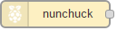
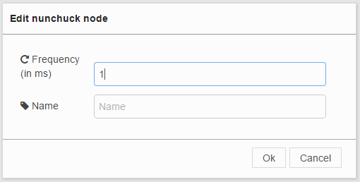
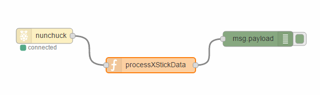

# node-red-contrib-nunchuck
A Node RED node to read data from nunchuck device mounted on I2C bus

##Installation
From the node-red user data directory launch:

       npm install node-red-contrib-nunchuck

 After node-red restart it will be available a new node called "nunchuck" in output directory.

 

##Usage
The node has two config properties:

 

  - name: the name of the node
  - frequency: this value sets the quite period in milliseconds between each read request to the nunchuck controller over the i2c bus. (e.g.: 100 means 10 requests in 1 second).

You can refer the [nunchuck.js](https://github.com/muten84/nunchuck.js) libray for the JSON object spec returned by the node.

Check out my [blog post ](http://www.luigibifulco.it/blog/en/blog/raspberrypi-nunchuck-nodered-a-lot-of-fun) for examples and basic configuration.

###Flow Example:


```
[{"id":"3818fd96.c7e702","type":"function","z":"e8c028bd.173fd8","name":"processXStickData","func":"var xevent = msg.payload.x ;\nif(context.xevent !== xevent){\n context.xevent = xevent; \n node.send(msg);\n}\nreturn;","outputs":1,"noerr":0,"x":353,"y":158,"wires":[["e7a89ba0.185768"]]}]
```

###Updates:
This node-red project now depends on [nunchuck.js](https://github.com/muten84/nunchuck.js) node.js module, it provides a decoder object and a nunchuck device object.

###TODO:
The resulting JSON object will be extended with more other nice info derived by the accelerometer such as:
 - motion verse detection: left, right, up, down
 - tilt: tilt-left, tilt-right, tilt-up, tilt-down
 - rotation angles: xAngle, yAngle, zAngle (values in radians)
Stay tuned!
